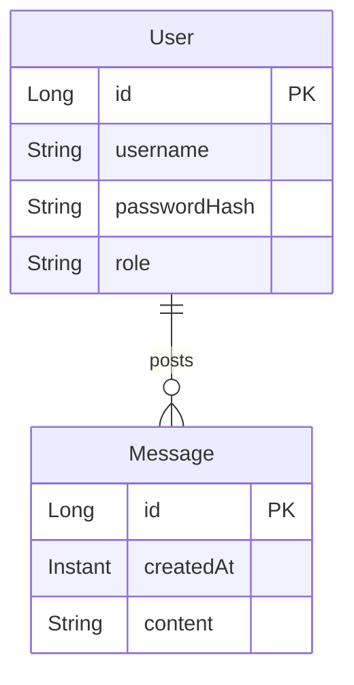

# 🗨️ Messenger

[](https://github.com/hh-ohjelmistoprojekti-2/spring-boot-vite-example/actions/workflows/ci.yml)

_Messenger_ is a simple messaging application where registered users can post messages and see other users' posted messages. The project acts as an example project for a single-page application with authentication. It is implemented with Spring Boot and React.

## Data model

The application's data model consists of the following entities:

- `User`: represents a registered user with a unique username, a hashed password, and a role. A user can have many messages.
- `Message`: represents a message posted by a user, containing text content and a creation timestamp. Each message belongs to one user.



## Developer guide

The project architecture consists of the _backend application_ and the _frontend application_. The backend application contains a REST API implemented with Java and [Spring Boot](https://spring.io/projects/spring-boot). The backend application uses [H2 Database Engine](https://www.h2database.com/html/main.html) as a development environment database and [PostgreSQL](https://www.postgresql.org/) as a production environment database. The frontend application is implemented with JavaScript and [React](https://react.dev/). The user interface is implemented with [Material UI](https://mui.com/). The [Vite](https://vitejs.dev/) build tool is used to develop and build the frontend application.

### Backend

The backend application requires Java version 17 as a minimum version.

You need to perform the following steps to set up the backend application:

1. Add a `application-local.properties` file to the `src/main/resources` folder (same folder that has the `application.properties` file) with the following content:

   ```
   auth.jwt-secret=<jwt-secret>
   ```

   Replace the `<jwt-secret>` with a string that has at least 48 characters.

Then, you can start the backend application by performing the following steps:

1. Start the server by running the `./mvnw spring-boot:run` command
2. Once the server has started, the application is accessible at <http://localhost:8080>

#### Running tests

You can run the backend tests by running the `./mvnw test` command.

#### Running with Docker

Docker can be used to deploy the backend application or run it locally. In the production environment, the Docker container requires the environment variables defined in the [application-production.properties](https://github.com/Kaltsoon/spring-boot-vite-example/blob/main/src/main/resources/application-production.properties) file.

The backend application can be started with Docker by performing the following steps:

1. Build the image by running the `docker build . -t messenger-backend` command
2. Create and start the container by running the `docker run -p 8080:8080 messenger-backend` command
3. Once the server has started, the application is accessible at <http://localhost:8080>

By setting the `SPRING_PROFILES_ACTIVE` environment variable value as `production`, the application will use the production environment properties.

### Frontend

The frontend application requires Node.js version 18 as a minimum version.

You can start the frontend application by performing the following steps in the `frontend` folder:

1. Install the dependencies by running the `npm install` command
2. Start the Vite development server by running the `npm run dev` command
3. Once the development server has started, the application is accessible at <http://localhost:5173>

#### Running tests

You can run the frontend tests by running the `npm run test` command in the `frontend` folder.

## REST API

The REST API has [Swagger documentation](http://localhost:8080/swagger-ui/index.html) (accessible when the backend server is running).

## License

Messenger is licensed under the [MIT license](./LICENSE).
